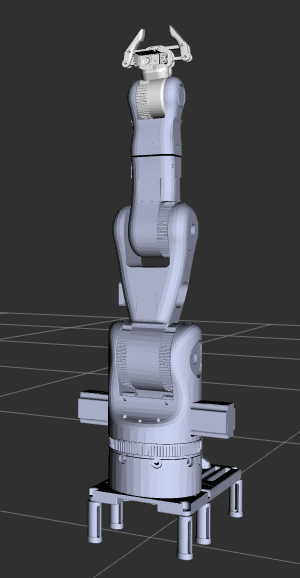

# Robotic Arm Simulation with ROS2 Humble

<p align="center">
  
</p>


## Table of Contents

- [Project Description](#project-description)
- [Features](#features)
- [Prerequisites](#prerequisites)
- [Installation](#installation)
- [Setup](#setup)
- [Usage](#usage)
  - [Camera Calibration](#camera-calibration)
  - [Launching the Simulation](#launching-the-simulation)
  - [Controlling the Robotic Arm](#controlling-the-robotic-arm)
  - [Object Pick and Place](#object-pick-and-place)
- [Architecture](#architecture)
- [Technologies Used](#technologies-used)
- [Contributing](#contributing)
- [Documentation](#documentation)
- [License](#license)

## Project Description

This project simulates and controls a robotic arm using **ROS2 Humble**, **Gazebo**, and **MoveIt2**. The robotic arm is defined using URDF (Unified Robot Description Format) and is capable of executing planned trajectories within a simulated environment. The simulation integrates ROS2 control with MoveIt2 for advanced motion planning and trajectory execution. Additionally, the robotic arm is controlled using a camera and ArUco markers placed on the robot, workspace, and objects, enabling precise object pick and place operations through image processing and computer vision techniques.

## Features

- **Simulation Environment**: Realistic simulation using Gazebo.
- **Motion Planning**: Advanced trajectory planning with MoveIt2.
- **Control Mechanism**: Camera-based control using ArUco markers.
- **Object Manipulation**: Pick and place objects within the simulated workspace.
- **Camera Calibration**: Accurate camera setup for reliable image processing.
- **Modular Design**: Integration of Python and C++ for flexibility and performance.

## Prerequisites

- **Operating System**: Ubuntu 22.04
- **ROS2 Distribution**: ROS2 Humble
- **Simulation Environment**: Gazebo
- **Motion Planning**: MoveIt2
- **Additional Tools**:
  - `meshlab` for mesh processing

## Installation

1. **Update Package Lists**

    ```bash
    sudo apt update
    ```

2. **Install ROS2 Humble and Required Packages**

    ```bash
    sudo apt install -y \
      ros-humble-ros2-control \
      ros-humble-ros2-controllers \
      ros-humble-joint-state-broadcaster \
      ros-humble-robot-state-publisher \
      ros-humble-controller-manager \
      ros-humble-joint-trajectory-controller \
      ros-humble-rqt \
      ros-humble-rqt-common-plugins \
      ros-humble-rqt-graph \
      ros-humble-gazebo-ros-pkgs \
      ros-humble-gazebo-ros2-control \
      ros-humble-xacro \
      ros-humble-diagnostic-updater \
      ros-humble-rviz2 \
      ros-humble-tf2-tools \
      ros-humble-ros2bag
    ```

3. **Install Additional Dependencies**

    ```bash
    sudo apt install -y meshlab
    ```

4. **Clone the Repository**

    ```bash
    git clone https://github.com/Eliottfrhl/Robot5A.git
    ```

5. **Build the Workspace**

    ```bash
    cd ~/Robot5A
    source /opt/ros/humble/setup.bash
    colcon build
    ```

6. **Source the Workspace**

    ```bash
    source ~/Robot5A/install/setup.bash
    ```

## Setup

1. **Camera Calibration**

    Accurate camera calibration is essential for reliable image processing and marker detection.

    ```bash
    command for camera calibration that can be used to guide new contributers
    ```

    Follow the on-screen instructions to complete the calibration process and save the calibration parameters.

## Usage

### Launching the Simulation

Start the Gazebo simulation environment with the robotic arm.

```bash
ros2 launch robot_description gazebo.launch.py
```

### Controlling the Robotic Arm

The robotic arm is controlled using a camera that detects ArUco markers. Ensure the camera is calibrated and has a clear view of all markers.

```bash
ros2 run robot_control node_name # Check CMakeLists.txt for node's names identification
```

### Object Pick and Place

To perform object pick and place operations, use the provided Python and C++ scripts that interface with MoveIt2 for motion planning.

1. **Start MoveIt2**

    ```bash
    ros2 launch robot_moveit_config moveit_gazebo.launch.py
    ```

2. **Execute Pick Operation**

    ```bash
    # In progress
    ```

3. **Execute Place Operation**

    ```bash
    # In progress
    ```

### Image Processing

Image processing scripts handle the detection of ArUco markers and object recognition.

```bash
ros2 run robotic_control object_detector
```

## Architecture

The project is structured into several key components:

- **URDF Definition**: Defines the physical and visual properties of the robotic arm.
- **ROS2 Control**: Manages the hardware interfaces and controllers for joint movements.
- **MoveIt2 Integration**: Handles motion planning and trajectory execution.
- **Gazebo Simulation**: Provides a realistic environment for testing and development.
- **Camera and ArUco Markers**: Facilitates precise control and object tracking through computer vision.
- **Python and C++ Nodes**: Implements control logic, image processing, and communication between components.

## Technologies Used

- **ROS2 Humble**: Robot Operating System for middleware and communication.
- **Gazebo**: Simulation environment for robotics.
- **MoveIt2**: Motion planning framework.
- **URDF**: Robot description format.
- **Python**: Scripting and automation.
- **C++**: Performance-critical components.
- **OpenCV**: Image processing and computer vision.
- **ArUco**: Marker-based tracking.

## Contributing

Contributions are welcome! Please follow these steps:

1. **Fork the Repository**
2. **Create a Feature Branch**

    ```bash
    git checkout -b feature/YourFeature
    ```

3. **Commit Your Changes**

    ```bash
    git commit -m "Add your feature"
    ```

4. **Push to the Branch**

    ```bash
    git push origin feature/YourFeature
    ```

5. **Open a Pull Request**

## Documentation

All C++ nodes created under robot control package are documented using Doxygen check the **docs/html/index.html** for an interactive code docs 

## License

This project is licensed under the MIT License.

---

*Developed by [Eliott & Omar](https://github.com/Eliottfrhl)*

# Notes to myself

export robot_description folder as gazebo resource path for materials
